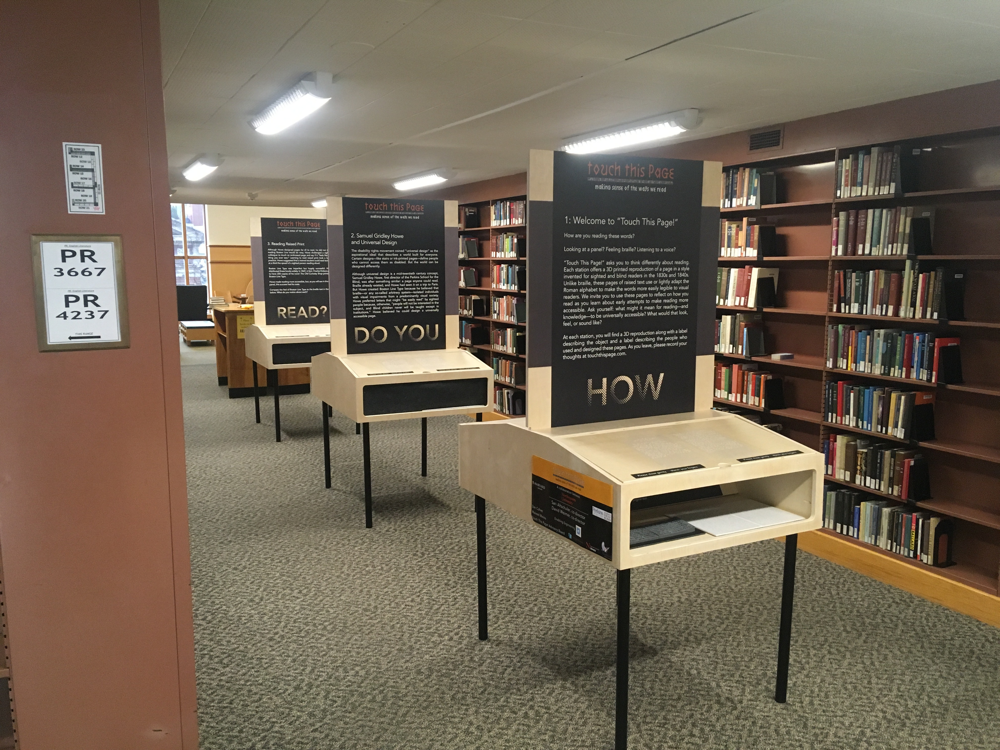
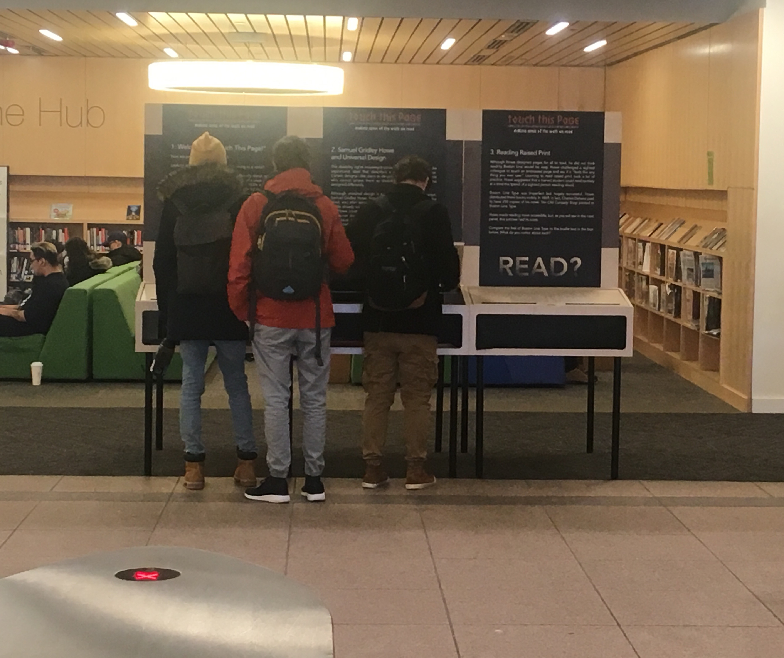
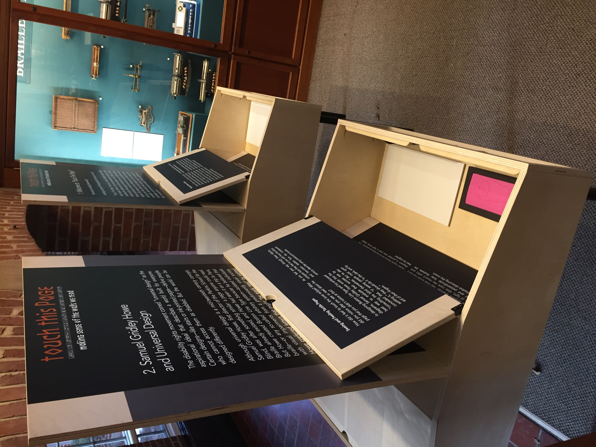

+++
title = 'About'
omit_header_text = true
featured_image = ""
layout = "single"
+++

## "Touch This Page!" - An Introduction

"Touch This Page!" has always been a hybrid project. We want to make these objects broadly available through physical and digital surrogates while providing digestible narratives to contexualize them within a shared experience of reading. 

As a pop-up style, physical exhibtion, "Touch This Page!" was designed to prioritize tactile engagment. The larger panels of text gave the braoder story of this specific form of inkless printing. Visitors could then reach into the exhibition's boxes to feel the objects. Additional text on panels that visitors could open from above the objects described the objects and quoted responses from students and alumni of Perkins. From the week of January 28, 2019 through mid-April 2019, the exhibition launched  simultaneously at four locations. 

At Harvard University, it was in [Lamont Library](https://library.harvard.edu/libraries/lamont), arranged vertically down a hallway between bookshelves. 

At Northeastern University, the exhibition greeted visitors at the main entry to [Snell Library](https://library.northeastern.edu/ideas/about-snell-library/).

At the [Perkins School for the Blind](https://www.perkins.org/), the exhibtion sat alongside other objects from the school's long history in their museum.

And at [Norman B. Leventhal Map and Education Center](https://www.leventhalmap.org/) at the Boston Public Library (at Copley Square), it usherd people through the hallway and into their gallery space. The exhibition was subsequently hosted at the [Watertown Free Public Library](https://watertownlib.org/) and NYU's [Bobst Library](https://library.nyu.edu/locations/elmer-holmes-bobst-library/). The onset of the COVID pandemic curtailed our ability to send the exhibition to more sites.

"Touch This Page!" is co-directed by [Sari Altschuler](https://cssh.northeastern.edu/faculty/sari-altschuler/) (Northeastern University) and [David Weimer](https://www.newberry.org/about/staff-directory) (Newberry Library). It was undertaken in collaboration with [Dan Cohen](https://cssh.northeastern.edu/people/faculty/dan-cohen/) at the Northeastern Library, [Waleed Meleis](https://coe.northeastern.edu/people/meleis-waleed/) at the Northeastern University College of Engineering, and Kim Charlson, Jennifer Arnott, and Jen Hale at the Perkins School for the Blind.

## News and Awards

In 2019 "Touch This Page!" won the [Library Company's inaugural Biennial Innovation Award](https://librarycompany.org/2019/10/01/innovation-prize-winners/). The project was then featured in the Library Company's podcast, [Talking in the Library](https://librarycompany.org/2020/01/31/talking-in-the-library-season-2-episode-5/).

"Touch This Page!" received the [2019-2020 Public Disability History Award](https://dishist.org/?page_id=1230) from the Disability History Association. 

[Andrew Leland](https://www.andrewleland.org) worked closely with us and recorded [The Universal Page](https://99percentinvisible.org/episode/the-universal-page), an episode of [99% Invisible](https://99percentinvisible.org/), at the project's symposium in 2019.  

The exhition was reviewed by [Madeline J. Williams in *American Quarterly*](https://muse.jhu.edu/article/744977) and by [Sara Dean in *The Public Historian*](https://www.jstor.org/stable/26908891).  

## Artefacts

The artefacts for the exhibition were created in partnership with [Enabling Engineering](https://www.enablingengineering.org/) at Northeastern University, the Harvard Library, and the Perkins School for the Blind. The [Digital History team of Harvard's History Department](https://history.fas.harvard.edu/digital_history) lent us the 3D-scanner we used to produce these models.

## Humanities Advisors

- [Rachel Adams](https://english.columbia.edu/content/rachel-adams), Columbia University
- [Kim Charlson](https://www.perkins.org/team-member/kim-charlson/), Perkins School for the Blind
- [Georgina Kleege](https://english.berkeley.edu/profiles/45), University of California, Berkeley
- [Catherine Kudlick](https://history.sfsu.edu/people/catherine-kudlick), San Fransisco State University
- [Robert McRuer](https://english.columbian.gwu.edu/robert-mcruer), George Washington University
- [Mara Mills](http://maramills.org/), New York University
- [Benjamin Reiss](https://english.emory.edu/home/people/bios/reiss-benjamin.html), Emory University

## Sponsors 

The exhibition is sponsored by the Perkins School for the Blind, Northeastern University (the provost’s office, Enabling Engineering, and the Northeastern Library), and the Harvard Library.